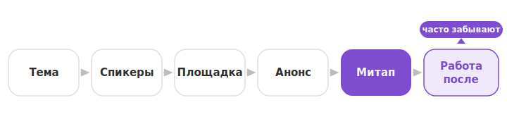

# Что такое митап: как собрать людей, обменяться опытом и не утонуть в организации

Хотите собрать коллег по цеху и обменяться опытом — узнайте, *что такое митап*, и проведите свою встречу без лишней возни. Формат кажется простым: позвал людей, выбрал тему, договорились. Но на планерке часто выходит иначе: кто-то предлагает «давайте проведем митап», все кивают — и повисает пауза. С чего начать, кто ищет спикеров, где всех собрать?

Разберем по порядку: что это за формат, чем он отличается от вебинара и конференции, зачем его проводить компании и как организовать встречу без бюрократии. И главное — что сделать после, чтобы от митапа остались идеи и контакты, а не только фото с пиццей.

## Что такое митап простыми словами

Митап, если объяснить простыми словами, — это неформальная встреча людей из одной сферы, чтобы обменяться опытом и познакомиться. Обычно это небольшая группа, один-три коротких доклада и живое обсуждение. Формальностей минимум. Проводят митапы и оффлайн, и онлайн.

Главное отличие от лекции — разговор на равных. Тут не «эксперт вещает залу», а коллеги делятся тем, что реально работает. Один рассказывает про свой проект, остальные задают вопросы, спорят, обмениваются контактами. Чаще всего встреча проходит вечером после работы и длится пару часов.

Организуют митапы по-разному. Их проводят HR- и комьюнити-менеджеры, тимлиды или просто энтузиасты, которым хочется собрать своих. Больших ресурсов для старта не нужно — важнее живая тема и люди, которым есть чем поделиться.

Обычно митап идет по простому сценарию: короткое приветствие, доклады, вопросы и свободное общение в конце. А вот подача бывает разной:

- классические доклады по 15–20 минут — когда есть чем поделиться подробно;
- блиц-выступления на пять минут (их называют lightning talks) — когда спикеров много, а времени мало;
- панельная дискуссия — когда несколько экспертов спорят на одну тему;
- воркшоп — когда участники что-то делают руками, а не только слушают.

Формат выбирают под тему и силы организатора. Часто их даже смешивают: пара докладов, а потом общая дискуссия.

> **Интересный факт.** Слово «митап» пришло из английского *meet up* — «собраться вместе». Формат разошелся в начале 2000-х: в 2002 году появилась платформа Meetup.com, вокруг которой люди собирались по интересам. Больше всего он прижился в IT — с короткими докладами, спорами и почти обязательной пиццей. Пицца на митапах давно стала традицией: и накормить участников проще, и общаться за столом легче.

## Зачем компании и команде проводить митапы

Митап закрывает сразу несколько задач. Вот четыре причины, ради которых компании и команды их проводят.

- **Комьюнити и наем.** Внешний митап собирает вокруг компании специалистов из вашей сферы. Часть из них потом откликается на вакансии — это теплее и дешевле обычного найма. А еще люди запоминают компанию, которая дала им что-то полезное бесплатно.
- **Обмен опытом на равных.** Участники уносят рабочие приемы коллег из других команд и компаний. Не «просто пообщались», а увидели, как соседи решают похожие задачи.
- **Прокачка своих спикеров.** Сотрудники учатся понятно рассказывать о работе. Они растут сами, а компания получает контент и репутацию сильной команды.
- **Внутренние митапы.** Это неформальный обмен знаниями между отделами: что делает соседняя команда, как она справилась с похожей проблемой. Живее и быстрее вертикальных отчетов.

Не обязательно гнаться за всеми целями сразу. Даже один регулярный митап на узкую тему уже работает и на бренд, и на команду.

## Митап, вебинар, конференция и семинар: в чем разница

Форматы путают, хотя разница не в размере и пафосе, а в том, кто с кем говорит и зачем.

| Формат | Кто с кем говорит | Масштаб | Формальность | Зачем |
| --- | --- | --- | --- | --- |
| **Митап** | на равных, все со всеми | небольшой | низкая | обмен опытом, нетворкинг |
| **Вебинар** | один многим, онлайн | любой | средняя | обучение, презентация |
| **Конференция** | спикеры залу | крупный | высокая | масштабное событие, бренд |
| **Семинар** | ведущий группе | небольшой | средняя | обучение, отработка навыка |

Митап выбирают, когда нужен живой обмен, а не лекция. Конференция — крупное и формальное событие с бюджетом, спонсорами и расписанием. Вебинар устроен как «один вещает многим» онлайн, чаще для обучения или презентации. Семинар ближе к учебе в небольшой группе. Митап на их фоне — заметно гибче и камернее.

## Как организовать митап без лишней бюрократии

Хорошая новость: чтобы понять, *как организовать митап*, толстый регламент не нужен. Хватит нескольких понятных шагов, и у каждого — свой ответственный.

1. **Тема и аудитория.** Решите, о чем встреча и для кого. Узкая живая тема заходит лучше общей: «как мы ускорили сборку» интереснее, чем «про разработку вообще».
2. **Спикеры и доклады.** Найдите один-три коротких выступления. Заранее соберите тезисы и тайминг. Хорошо, если спикер прогонит доклад хотя бы раз до встречи.
3. **Формат и площадка.** Выберите оффлайн (переговорка, коворкинг, бар) или онлайн. Назначьте дату — обычно это вечер буднего дня.
4. **Анонс и регистрация.** Позовите людей там, где сидит ваша аудитория: в профильных чатах, соцсетях, рассылке. Анонс лучше дать за одну-две недели и напомнить о встрече накануне.
5. **Ведущий и тайминг.** Назначьте того, кто откроет митап, представит спикеров и проследит за временем. Он же следит, чтобы вопросы из зала не превратились в отдельный доклад.
6. **Техника.** Для оффлайна проверьте проектор и микрофон, для онлайна — ссылку и звук.
7. **Роли и сроки.** Пропишите, кто за что отвечает и к какому дню.

Чтобы подготовка не висела на одном энтузиасте, ведите ее как небольшой проект. Шаги выше — это задачи на доске, у каждой свой ответственный и срок. Например, заведите доску с колонками «Идеи», «В работе» и «Готово», а в карточках держите тему, спикеров, площадку, анонс и технику. Тогда за пару недель до митапа сразу видно, что готово, а что горит. «Без бюрократии» здесь значит, что все прозрачно и без совещаний ради статусов, а не что планировать вообще не нужно. А чтобы встречи по подготовке не затягивались, пригодятся наши [правила рабочих встреч](https://kaiten.ru/blog/sovety-i-pravila-rabochih-vstrech/).

*Митап держится на легком каркасе, а результат собирается уже после встречи.*

## Онлайн-митап и что делать после встречи

Митап не обязательно проводить в одном зале. Онлайн-митап доступнее: подключаются участники из разных городов, а встречу легко записать. Нужны площадка [видеосвязи](https://kaiten.ru/blog/chto-takoe-videokonferencsvyaz-vks/) и ведущий, который держит темп. Если выбираете, где собраться, посмотрите [сервисы для видеоконференций](https://kaiten.ru/blog/luchshie-servisy-dlya-videokonferencij/) и [правила видеосозвонов](https://kaiten.ru/blog/10-pravil-vidieosozvonov-kotoryie-dolzhien-znat-kazhdyi/), чтобы онлайн не превратился в неловкую тишину.

Онлайн внимание держать сложнее: люди легко отвлекаются на другие вкладки. Помогают короткие доклады, вопросы в чате и ведущий, который вовлекает участников по имени.

Но главная ценность появляется, когда все уже попрощались. Именно после митапа результат теряют чаще всего: доклады прошли, а идеи, контакты и договоренности расползлись по чатам.

Что стоит сделать после встречи:
- зафиксировать идеи и договоренности из обсуждения, пока их помнят;
- разослать участникам запись и материалы;
- собрать обратную связь и не растерять контакты;
- превратить «давайте повторим» и «надо доделать» в конкретные задачи с ответственными.

Работа после митапа (по-английски follow-up) превращает разовую встречу в регулярный формат: люди видят, что их идеи не пропали, и охотнее приходят снова.

Для онлайн-митапа или внутреннего командного митапа подойдут Кайтен Встречи (пока в бете). Это видеосвязь с записью прямо внутри Кайтена. После созвона AI собирает расшифровку с итогами, и договоренности можно сразу оформить задачами — они не осядут в переписке. Как это устроено, мы разобрали в статье про [Кайтен Встречи](https://kaiten.ru/blog/sozvony-v-kaiten-s-ai-rasshifrovkoi-kak-rabotaiut-kaiten-vstriechi/). А для разбора записи помогут [нейросети для записи встреч](https://kaiten.ru/blog/nejroseti-dlya-zapisi-vstrech/) и [транскрибация](https://kaiten.ru/blog/chto-takoe-transkribaciya/).

[ВИЗУАЛ: реальный скриншот Кайтен Встречи — расшифровка встречи и предложенные задачи, без конфиденциальных данных]

## Частые ошибки при организации митапа

Даже с хорошей темой митап легко испортить. Вот что подводит организаторов чаще всего.

- **Слишком длинно.** Пять докладов подряд утомляют. Лучше меньше выступлений и больше живого общения.
- **Нет ведущего и тайминга.** Без модератора встреча расплывается, а один спикер съедает время остальных.
- **Программа ради галочки.** Если доклады скучные, люди приходят один раз и не возвращаются. Тема должна цеплять.
- **Продажа вместо пользы.** Митап — не презентация продукта. Явная реклама со сцены отпугивает аудиторию.
- **Забыли про нетворкинг.** Если после докладов все сразу расходятся, теряется половина смысла: люди шли и ради общения тоже. Оставьте время и место, где можно поговорить.
- **Нет работы после встречи.** Митап прошел, а дальше тишина: материалы не разослали, задачи не поставили, контакты потеряли.

## Частые вопросы

**Что такое митап простыми словами?** Это неформальная встреча специалистов одной сферы, где обмениваются опытом и знакомятся.

**Чем митап отличается от вебинара?** Митап — живой разговор на равных, вебинар — формат «один вещает многим» онлайн.

**Сколько человек приходит на митап?** Обычно десятки: формат камерный, чтобы все успели пообщаться.

**Онлайн или оффлайн?** И так, и так. Онлайн доступнее, оффлайн живее и лучше для нетворкинга.

**Сколько длится митап?** Чаще один-три часа вечером буднего дня.

**Как выбрать тему для митапа?** Берите узкую задачу, которую недавно решили сами. Конкретный опыт заходит лучше общих обзоров.

**Нужен ли бюджет на митап?** Минимальный митап проводят почти бесплатно: переговорка, свои спикеры и чай. Основные траты — площадка и угощение, если зовете людей со стороны.

**Что делать после митапа?** Зафиксировать идеи, разослать запись и материалы, поставить задачи по договоренностям.

## Коротко о главном

Митап — это разговор на равных, а не лекция. Он выглядит простым, но держится на легком каркасе: тема, спикеры, площадка, анонс, ведущий. И на том, что происходит после: если зафиксировать идеи, контакты и задачи, митап превращается в пользу для команды и бренда, а не в «посидели и разошлись».

Проведите первый небольшой митап по шагам выше. А подготовку и задачи после ведите там, где команде все видно.

---

## Self-check автора (не для публикации)

- **Объем:** ~9 700 знаков с пробелами (посчитано по реальным символам, не байтам; цель ~10 000 — в пределах «около»).
- **Ключи (курсивом, равномерно):** *что такое митап* (лид, H2, FAQ), «митап … простыми словами» (H2 определения, FAQ), *meet up* (врезка), *как организовать митап* (H2 организации). Переспама нет.
- **Первое предложение под H1** — с побуждением к действию, содержит ключ (под сниппет).
- **Угол «на равных»** держится: лид, определение, таблица, заключение.
- **Ядро** — организация (7 шагов) + follow-up + частые ошибки; не тонкое.
- **Форматы митапов** вплетены прозой (доклады, lightning talks, панель, воркшоп), не отдельным словарным списком «видов».
- **Продуктовая связка легкая:** доска (1 мостик) + Кайтен Встречи (1 мостик, «бета»); без оговорки о масштабе; не «платформа для митапов».
- **Ссылки:** 6 внутренних, распределены, все проверены живыми (research §5); anchor осмысленный.
- **Редполитика:** без «е с точками», предложения короткие, активный залог; финальная сверка Vale/нейро-шлак — на этапе 05.
- **Факты:** только из research (meet up, 2002, культура IT, Кайтен Встречи). Историю про 11.09 не включал.
- **Добавлено против первой версии черновика (была ~7k):** блок «Частые ошибки», абзац про форматы митапов, детали в шагах организации и работе после, 2 вопроса в FAQ. Блок «ошибки» согласован на STOP 3.
- **SOFT-правки после скоринга (06) применены:** «follow-up» сведён к 1 вхождению с расшифровкой (в остальных местах — «работа после встречи»); «самый гибкий» → «заметно гибче и камернее». Объем ~9 750 знаков, «ё» — 0.
