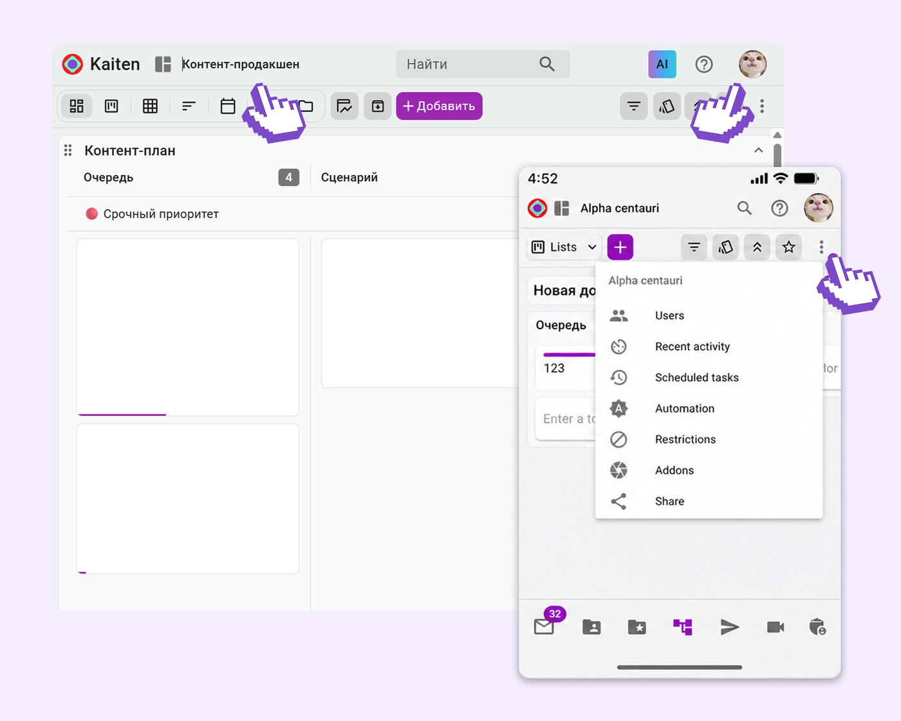
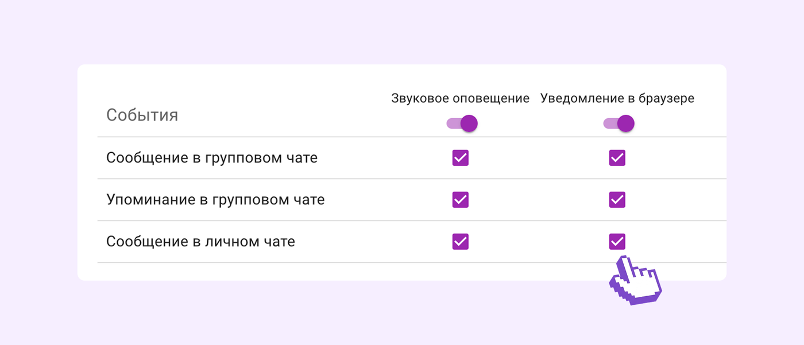
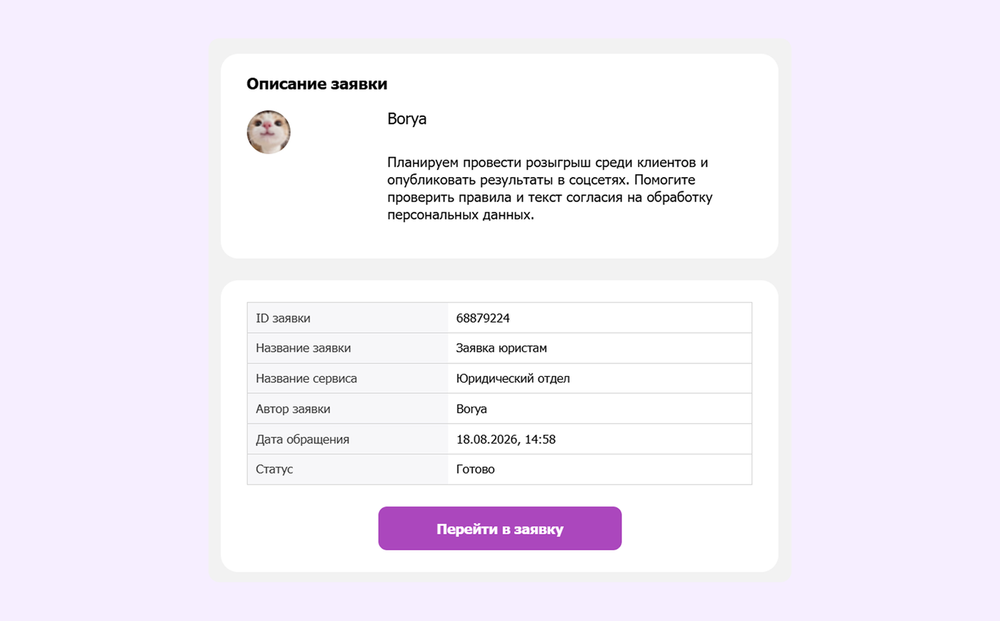

# Обновления Кайтена в августе 2026: файлы, дашборды и еще 20 улучшений

**Описание под заголовком:** Собрали вложения пространства в разделе «Файлы», добавили дашборды, подключили свой домен к Справочному центру и обновили навигацию

В августе в Кайтене появились дашборды и новый вид «Файлы» в пространствах. Еще мы разрешили размещать Справочный центр на домене компании, обновили навигацию и дали настроить уведомления из чатов.

Ниже разбираем главные обновления месяца.

## Все файлы пространства собрались в одном разделе

В пространствах появился новый вид «Файлы». В нем собраны все вложения проекта, поэтому вспоминать, к какой карточке прикрепили нужный документ, больше не нужно. Искать вложения можно по названию или через фильтры.

Рядом с этим в администрировании появился раздел «Хранилище». В нем видно статистику по файлам всей компании. `[ССЫЛКА: вид «Файлы» в базе знаний]`

`[НУЖНО УТОЧНИТЬ: на каких тарифах доступны вид «Файлы» и раздел «Хранилище»]`

## Дашборды: статистика по аккаунту на одном экране

Следить за проектами, нагрузкой команды и отдельными процессами можно на дашбордах. На дашборд вы добавляете списки задач, показатели и диаграммы, причем данные берутся из разных пространств сразу. Набор виджетов вы настраиваете под свои задачи. `[ССЫЛКА: дашборды в базе знаний]`

Вместе с самими дашбордами в августе вышло несколько доработок.

### Копирование виджетов

Готовый виджет можно скопировать на текущий или на любой другой дашборд, который вам доступен для редактирования. Счетчик или список задач можно перенести в отчет для другой команды и оставить те же настройки.

### Наборы фильтров и состояние карточек

Наборы фильтров теперь сохраняются: по проектам, командам или типам задач. Переключение между ними меняет данные сразу во всех виджетах.

Отдельный фильтр отвечает за то, какие карточки виджет вообще учитывает: активные, архивные или все сразу. Так на одном экране можно следить за текущей работой, смотреть данные по завершенным задачам или собирать общую статистику.

### Администрирование дашбордов компании

В Kaiten появился доступ к администрированию всех дашбордов компании. Пользователь с таким доступом меняет их настройки, виджеты и состав участников — даже если дашборды создали другие сотрудники.

## Обновленная навигация

Мы обновили навигацию в десктопной и мобильной версии Kaiten. Путь к открытому разделу переехал в верхнюю панель, а профиль и справка — в правый верхний угол.

Для пути стало больше места. По нему видно, где вы находитесь, даже если раздел лежит глубоко в структуре. Основные элементы на разных устройствах расположены похожим образом. После перехода с компьютера на смартфон искать их будет проще.

*Основные элементы навигации на компьютере и в мобильном приложении расположены похожим образом*

## Обновления в итерациях

За август в «Итерациях» вышло четыре изменения — от массовых действий до отображения на доске.

### Массовое добавление задач

В «Итерациях» можно выбрать несколько задач и добавить их в нужный рабочий период. Обратное действие тоже работает: несколько задач можно убрать из итерации и вернуть в список нераспределенных. `[ССЫЛКА: итерации в базе знаний]`

### Итерации в фильтрах, таблицах и карточках

Карточки можно отфильтровать по участию в итерациях — на пространствах, в виджетах и на дашбордах. В Таблицах и в самой карточке видно, к какому рабочему периоду относится задача.

### Итерации на фасаде карточек

На фасаде карточки видно, в какой итерации она участвует. Достаточно взглянуть на доску, чтобы понять, какие задачи вошли в текущий рабочий период, а какие запланированы на следующий.

### Редактирование завершенных итераций

В отчете «График сгорания итерации» появилось меню действий для завершенных итераций. Если нужно навести порядок, их можно переименовать, изменить цель или удалить.

## Уведомления из чатов стало можно настроить

Уведомления из чатов можно настроить отдельно для сообщений в личных чатах, в групповых и для упоминаний. Для каждого типа событий вы выбираете, нужен ли звук и нужно ли уведомление в браузере.

Оставьте сигналы только для важного. Тогда на них получится реагировать быстрее, а остальные сообщения не будут отвлекать.

*Для каждого типа сообщений звук и уведомление в браузере включаются отдельно*

В мобильном приложении Kaiten уведомления из чатов тоже появились. Они помогают не пропустить новое сообщение или упоминание, когда вы не у компьютера. По нажатию Kaiten открывает нужный чат или ветку обсуждения.

## Поля каталогов в автоматизациях и дочерних карточках

Мы расширили возможности каталогов. Поля, связанные с каталогами, теперь можно использовать в автоматизациях и переносить в дочерние карточки. Контакты, компании и другие записи не придется указывать вручную в каждой новой карточке. `[ССЫЛКА: каталоги в базе знаний]`

Еще одно изменение в Каталогах пригодится тем, кто звонит клиентам: рядом с номером телефона появилось локальное время клиента. Перед звонком можно проверить его часовой пояс и выбрать подходящее время для разговора.

## Справочный центр на домене компании

Справочный центр можно разместить на домене вашей компании. Клиенты и сотрудники будут открывать инструкции и обращаться в поддержку по знакомому адресу с названием вашего бренда.

`[НУЖНО УТОЧНИТЬ: как подключается собственный домен Справочного центра и есть ли ограничения]`

## Подробные почтовые уведомления Службы поддержки

Почтовые уведомления Службы поддержки стали подробнее. В письмо можно добавить описание заявки, вложения, метки и заполненные поля.

Заказчик видит актуальную информацию об обращении прямо в письме. Переходить для этого в Справочный центр ему не нужно.

*В письмо попадают описание заявки, заполненные поля и кнопка перехода к самому обращению*

## Что еще

**Скачивание всех файлов карточки одним архивом.** Все файлы из карточки можно скачать одним архивом — сохранять каждое вложение по отдельности больше не нужно.

**Фильтр по ответственному и экспорт в «Воронке продаж».** Фильтр показывает показатели продаж по одному или нескольким сотрудникам, а результат отчета вы скачаете в один клик.

**Выгрузка записей Журнала аудита в Excel.** Записи Журнала аудита можно скачать в формате Excel. Настройте фильтры в Kaiten и получите готовую для анализа таблицу: входы в аккаунт, изменения прав или действия с пользователями за нужный период.

**Деактивация пользователей, выбывших из синхронизации с директорией.** Когда сотрудник переходит в другой отдел и администратор убирает его из группы в директории, после синхронизации Кайтен автоматически деактивирует учетную запись и освобождает лицензию.

**Управление глобальными функциями на тарифах Enterprise.** Отключать загрузку файлов с устройства, из Dropbox и Google Drive в «Настройках компании», а также Чаты и Встречи из левой панели управления теперь можно только на тарифах Enterprise.

## На этом в августе все

Мы продолжаем развивать Кайтен и рассказывать, что в нем меняется. Если у вас есть идеи или замечания по обновлениям, напишите в техническую поддержку.

Следить за изменениями удобно в базе знаний. В разделе «Что нового в Кайтене» мы публикуем описание каждой функции сразу после выпуска.

---

## Служебное для редактора (в публикацию не идет)

**Разделы без иллюстраций** — в исходном документе картинки не загрузились, скриншоты
нужно запросить у продуктовой команды:

- Все файлы пространства собрались в одном разделе
- Дашборды: статистика по аккаунту на одном экране
- Обновления в итерациях (массовое добавление задач)
- Поля каталогов в автоматизациях и дочерних карточках
- Справочный центр на домене компании

**Пометки в тексте:** 2 × `[НУЖНО УТОЧНИТЬ]`, 4 × `[ССЫЛКА]`. Подробности — в
`07_qa_report.md`.
